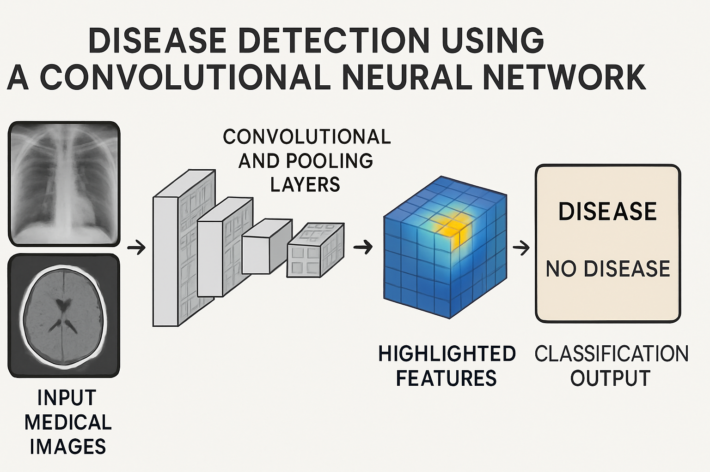

🩺 Pneumonia Detection from Chest X-Ray Images Using Deep Learning

This project develops a Convolutional Neural Network (CNN) to classify chest X-ray images for early pneumonia detection, 
assisting healthcare professionals in diagnosis and treatment planning, particularly in resource-constrained settings.

🚀 Problem Statement
* Automate pneumonia detection from chest X-rays using deep learning.
* Build and train a CNN to classify images accurately.
* Apply data augmentation to improve generalization.
* Evaluate using accuracy, precision, recall, and analyze misclassifications to identify improvement areas.

🖥️ System Requirements
✅ IDE: Google Colab with T4 GPU
✅ Libraries:
NumPy, Pandas – Data manipulation
Seaborn, Matplotlib – Data visualization
KaggleHub – Dataset import
PIL – Image loading and resizing
TensorFlow – CNN model building and training
Scikit-Learn – Model evaluation (accuracy, precision, recall, confusion matrix)

⚡ Workflow
1️⃣ Dataset Loading: Import X-ray dataset using KaggleHub into Colab.
2️⃣ Dataset Structure: Organized into train, test, val, each with Normal and Pneumonia categories.
3️⃣ Visualization: Explore and visualize samples.
4️⃣ Data Augmentation: Apply augmentation (rotation, zoom, flips) with ImageDataGenerator.
5️⃣ Preprocessing: Resize images to (150, 150) and prepare data splits.
6️⃣ Model Building: Sequential CNN with layers:
   Conv2D, MaxPooling2D with filters [32, 64, 128, 256]
   Total parameters: ~1,995,649
7️⃣ Training Configuration:
   Learning rate: 1e-6
   Epochs: 15
   Batch size: 32
8️⃣ Evaluation:
Achieved 92% accuracy on the testing set.
Visualized confusion matrix.
79 misclassifications, including 5 critical false negatives requiring further attention.  

✅ Conclusion
The CNN model achieved 92% testing accuracy in pneumonia detection.
5 critical false negatives emphasize the need for further fine-tuning and dataset expansion.
The project demonstrates deep learning’s potential in automated medical image analysis to support early pneumonia diagnosis.

🚀 Future Scope
Advanced Architectures: Utilize VGG16, ResNet, or EfficientNet with GPU optimization and quantization for efficient deployment.
Dataset Expansion: Add diverse, high-quality X-ray images to improve generalization.
Class Imbalance Handling: Use SMOTE, weighted loss, or oversampling to reduce false negatives.
Explainable AI: Integrate Grad-CAM or saliency maps for interpretability.
Deployment: Use TensorFlow Lite or ONNX for healthcare integration.
Multi-Disease Classification: Extend to detect other diseases (e.g., tuberculosis, COVID-19).

📚 References
Kaggle: For dataset and data interpretation.
CNN research papers and technical blogs for architecture understanding and implementation guidance.

  
